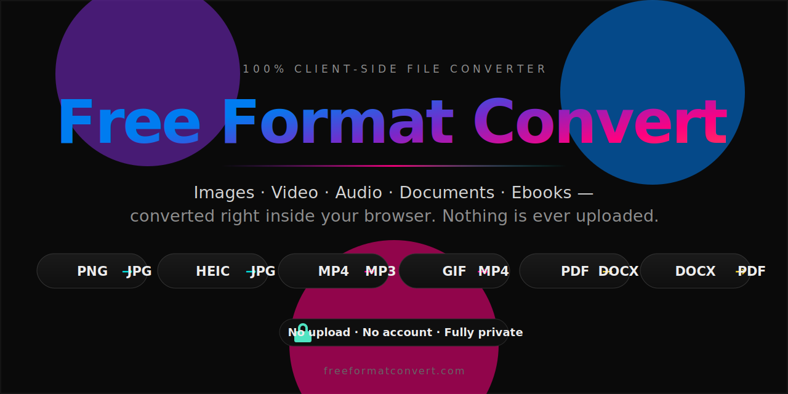
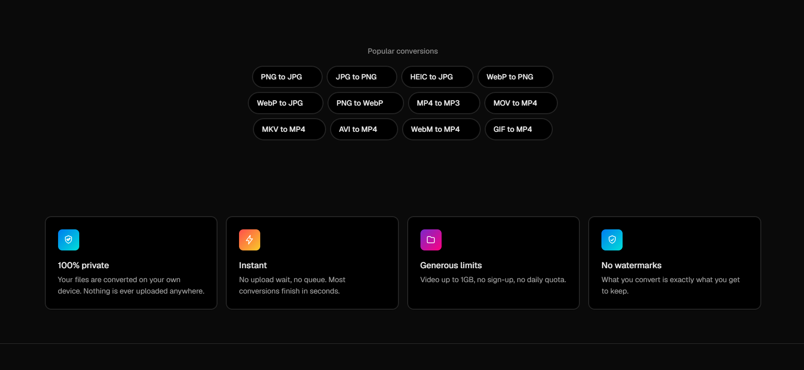

<div align="center">

<a href="https://freeformatconvert.com">
  
</a>

<br>

<p>
  <a href="https://freeformatconvert.com"></a>
  <a href="https://github.com/atharva236723/FreeFormatConvert/releases/latest"></a>
  <a href="https://github.com/atharva236723/FreeFormatConvert/actions/workflows/ci.yml"></a>
  <a href="LICENSE"></a>
  
</p>

### Convert images, video, audio, documents & ebooks — entirely in your browser.

**No backend. No upload. No account.** Every conversion runs on your own device, so your files never leave it.

<p>
  <a href="https://freeformatconvert.com"><b>▶&nbsp; Live Demo</b></a>
  &nbsp;·&nbsp;
  <a href="FEATURES.md"><b>📖&nbsp; Features</b></a>
  &nbsp;·&nbsp;
  <a href="https://github.com/atharva236723/FreeFormatConvert/issues/new/choose"><b>🐛&nbsp; Report a Bug</b></a>
  &nbsp;·&nbsp;
  <a href="CONTRIBUTING.md"><b>🤝&nbsp; Contribute</b></a>
</p>

</div>

---

<div align="center">



</div>

## ✨ Why it's different

Most online converters upload your file to a server. This one doesn't — there is **no backend at all**. Images, audio, video, documents and ebooks are all decoded, transcoded and re-encoded locally using the Canvas API, [ffmpeg.wasm](https://ffmpegwasm.netlify.app/), and a handful of pure-JS document libraries.

| | |
|---|---|
| 🔒 **Private by design** | Nothing is ever uploaded — all processing happens locally in the browser. |
| 🖼️ **Images** | Instant Canvas fast path for JPG / PNG / WebP, HEIC decode, and image → PDF. |
| 🎬 **Audio & video** | Full transcoding via a lazily-loaded ffmpeg WebAssembly core (~30&nbsp;MB, fetched only when needed). |
| 🎞️ **Animated GIF / APNG** | Convert straight to video (MP4 / WebM) with the animation preserved. |
| 📄 **Documents & ebooks** | DOCX ↔ PDF, PDF ↔ Word, PDF ↔ EPUB, and PDF → JPG / PNG. |
| 🧰 **Standalone tools** | Compress, resize, crop, rotate, merge/split PDFs, unit converters — all client-side too. |
| 🧭 **~690 SEO pages** | One auto-generated landing page per conversion pair. |
| 🌗 **Light / dark theme** | With no flash of the wrong theme on load. |

See **[FEATURES.md](FEATURES.md)** for the complete catalogue.

## 🚀 Getting started

> Requires **Node ≥ 22.12.0**

```sh
git clone https://github.com/atharva236723/FreeFormatConvert.git
cd FreeFormatConvert
npm install       # install dependencies
npm run dev       # start the dev server at localhost:4321
```

### Scripts

| Command | What it does |
|---|---|
| `npm run dev` | Start the dev server at `localhost:4321` |
| `npm run build` | Production build to `./dist/` |
| `npm run preview` | Preview the production build locally |
| `npx astro check` | Full TypeScript type-check |

> **Note:** `npm run build` transpiles TS with esbuild and only type-checks `.astro` files — run `npx astro check` separately to type-check `.ts` files. There is no linter or test suite configured.

## 🧱 Tech stack

**[Astro](https://astro.build)** (static, no SSR) · vanilla-TS custom elements (no UI framework) · **Canvas API** · **[ffmpeg.wasm](https://ffmpegwasm.netlify.app/)** · `pdfjs-dist` · `pdf-lib` · `jsPDF` · `mammoth` · `docx` · `jszip` · `heic2any` — deployed to **Cloudflare Workers** (static assets).

## 📁 Project structure

```text
src/
├── components/             # UI components (Converter, NavBar, Footer, hubs…)
├── layouts/Layout.astro    # shared page shell + theme/head
├── lib/
│   ├── formats.ts          # single source of truth for supported formats
│   ├── converter/          # conversion engines + orchestrator
│   │   ├── index.ts        #   picks the engine, normalizes errors
│   │   ├── imageEngine.ts  #   Canvas fast path
│   │   ├── ffmpegEngine.ts #   audio/video via ffmpeg.wasm
│   │   └── documentEngine.ts #  documents & ebooks
│   └── tools/              # standalone tool logic (compress/edit/pdf/units)
├── pages/                  # routes (incl. [conversion].astro → ~690 pages)
├── scripts/                # vanilla-TS custom elements & behaviours
└── styles/                 # design tokens + global CSS
```

## 📚 Documentation

| Doc | Purpose |
|---|---|
| **[FEATURES.md](FEATURES.md)** | Everything the app can do (user-facing catalogue). |
| **[CLAUDE.md](CLAUDE.md)** | Deep architecture reference — engines, orchestrator, page composition. |
| **[DESIGN.md](DESIGN.md)** | Vercel-inspired design system and tokens. |
| **[CHANGELOG.md](CHANGELOG.md)** | Notable changes per release. |

## 🤝 Contributing

Contributions are welcome! Please read **[CONTRIBUTING.md](CONTRIBUTING.md)** first — the *"nothing leaves your device"* constraint shapes every change. Bug reports and feature requests use the [issue templates](.github/ISSUE_TEMPLATE).

## 📄 License

Released under the **[MIT License](LICENSE)**.

<div align="center">
<br>
<sub>Built with ❤️ and a stubborn refusal to upload your files anywhere.</sub>
<br>
<a href="https://freeformatconvert.com"><b>freeformatconvert.com</b></a>
</div>
